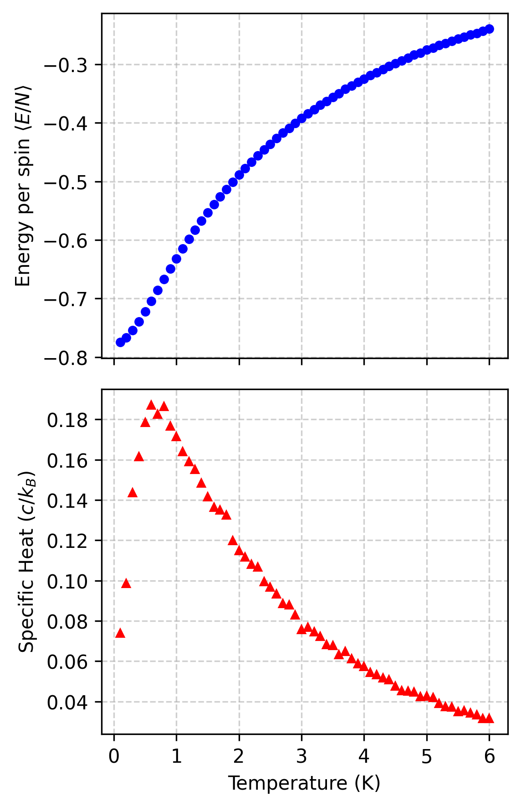
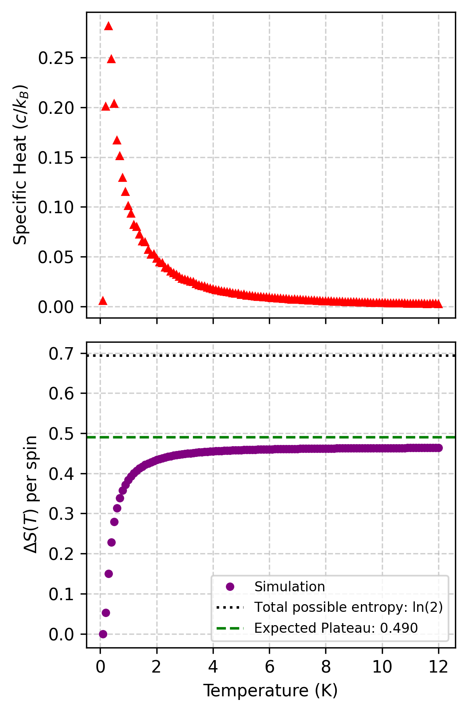

# Spin Ice & 2D Ising Model Monte Carlo Simulations

[](https://isocpp.org/)
[](https://www.python.org/)
[](https://opensource.org/licenses/MIT)

## Overview
This repository contains high-performance Monte Carlo simulations of statistical mechanics models, specifically focusing on the **3D Spin Ice model**. 

The core physics engine is written in Object-Oriented C++ to leverage high-speed computation for millions of Metropolis-Hastings sweeps. The resulting thermodynamic data is processed, analyzed, and visualized using a custom Python command-line interface (CLI).

## Key Features
* **Metropolis-Hastings Algorithm:** Robust implementation of Markov Chain Monte Carlo (MCMC) methods to simulate spin dynamics, thermalization, and phase transitions.
* **3D Spin Ice Thermodynamics:** Generates a 16-basis tetrahedral lattice to calculate Energy, Magnetisation, Specific Heat ($C_v$), and Magnetic Susceptibility ($\chi$) across varying temperatures.
* **Residual Entropy Calculation:** Simulates the highly degenerate "two-in, two-out" ground state of Spin Ice at near-zero Kelvin (in zero magnetic field) to observe Pauling's residual entropy plateau.
* **Data Visualization CLI:** A Python `argparse` tool utilizing Pandas and Matplotlib to cleanly generate publication-ready plots.

## Results & Physics

The simulations successfully capture the thermodynamic behavior of frustrated magnetic systems. Below are the key findings from the 3D Spin Ice model.

### 1. Spin Ice Thermodynamics
By simulating the system across a range of temperatures, we can observe the standard thermodynamic properties. As the temperature drops, the system minimizes its energy, and the specific heat capacity ($C_v$) peaks, indicating a transition into the ice-rule state.


*(Note: If your file is named differently, like Figure_4a_Energy_Cv.png, replace the path above!)*

### 2. Pauling's Residual Entropy
A key highlight of this project is the numerical recovery of **Pauling's Residual Entropy**. 

As temperature approaches absolute zero ($T \to 0$) in the absence of an external magnetic field, the Spin Ice system does not settle into a single unique ground state. Instead, it enters a highly degenerate manifold dictated by the "ice rules" (two spins pointing in, two pointing out of each tetrahedron). 

By integrating the specific heat capacity over the temperature range, the simulation successfully observes the entropy plateauing at $\approx \frac{1}{2} \ln(\frac{3}{2})$, perfectly matching theoretical predictions.


---

## Project Structure

```text
Spin-Ice-Simulation/
├── src/
│   ├── spin_ice.cpp             # Main thermodynamics simulation
│   └── low_temp_entropy.cpp     # Zero B-field entropy simulation
├── scripts/
│   └── plot_spin_ice.py         # Data visualization CLI
├── data/                        # Output datasets (.txt)
├── figures/                     # Generated plots (.png)
├── requirements.txt             # Python dependencies
└── README.md

